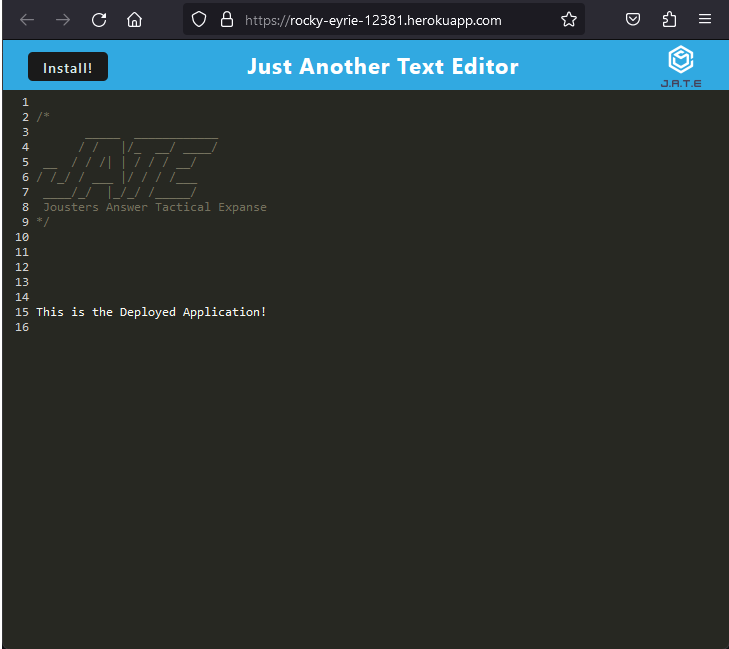

# pwa_text_edit
## Table of Contents
- [Description](#description)
- [User Story](#user-story)
- [Acceptance Criteria](#acceptance-criteria)
- [Table of Contents](#table-of-contents)
- [Installation](#installation)
- [Usage](#usage)
- [Tests](#tests)
- [Questions](#questions)


## Description
  
A full-stack PWA application that allows to enter text in a noSQL later use. The application text area persists in local storage.

The application uses a service worker, and can be installed independantly to be used offline.

This application uses ecommerce_db.


[Deployed Application on Heroku](https://rocky-eyrie-12381.herokuapp.com/)
</br></br>
  


## User Story
  
```
AS A developer
I WANT to create notes or code snippets with or without an internet connection
SO THAT I can reliably retrieve them for later use
```
  

## Acceptance Criteria
  
``` 
GIVEN a text editor web application
WHEN I open my application in my editor
THEN I should see a client server folder structure
WHEN I run `npm run start` from the root directory
THEN I find that my application should start up the backend and serve the client
WHEN I run the text editor application from my terminal
THEN I find that my JavaScript files have been bundled using webpack
WHEN I run my webpack plugins
THEN I find that I have a generated HTML file, service worker, and a manifest file
WHEN I use next-gen JavaScript in my application
THEN I find that the text editor still functions in the browser without errors
WHEN I open the text editor
THEN I find that IndexedDB has immediately created a database storage
WHEN I enter content and subsequently click off of the DOM window
THEN I find that the content in the text editor has been saved with IndexedDB
WHEN I reopen the text editor after closing it
THEN I find that the content in the text editor has been retrieved from our IndexedDB
WHEN I click on the Install button
THEN I download my web application as an icon on my desktop
WHEN I load my web application
THEN I should have a registered service worker using workbox
WHEN I register a service worker
THEN I should have my static assets pre cached upon loading along with subsequent pages and static assets
WHEN I deploy to Heroku
THEN I should have proper build scripts for a webpack application
```


## Installation 
Run the following commands at the project root directory.</br></br>- `npm i`</br>- `npm run build`</br>- `npm run start` </br>- Enter your text! </br>
  

## Usage 
This application a service worker and functions as a PWA</br>It can be installed to run offline </br></br> When uninstalling remember to unregister the serverice worked and remove the localstorage in your Inspection tools</br>- `Inspect -> Application -> Service Workers -> Unregister`</br>- `Inspect -> Application -> Storage -> Local Storage`


## Tests
No tests included.


## Questions
[Nathan Patnaude](mailto:Nathanpatnaude@gmail.com) , [GitHub Account](https://github.com/Nathanpatnaude)<br />
This Project is on [GitHub](https://github.com/Nathanpatnaude/pwa_text_edit)
